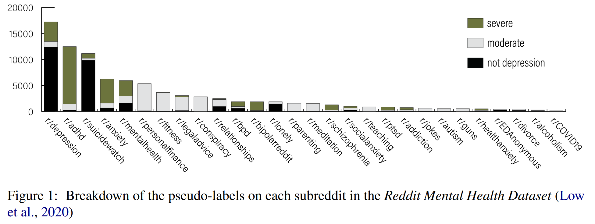

# Depression Detection with Reddit and Self-training
**In Development** <br>
This repository contains the implementation code for paper: <br>
__Rethinking the Value of Labels for Improving Class-Imbalanced Learning__ <br>
[Dean Ninalga](justin.ninalga@mail.utoronto.ca) <br>
_Proceedings of the Third Workshop on Language Technology for Equality, Diversity and Inclusion_ <br>
as part of _The 14th International Conference on Recent Advances in Natural Language Processing (RANLP), 2023_ <br>
[[Paper](https://aclanthology.org/2023.ltedi-1.29/)]

If you find this code or idea useful, please consider citing our work:
```bib
@inproceedings{ninalga-2023-cordyceps-lt,
    title = "Cordyceps@{LT}-{EDI} : Depression Detection with {R}eddit and Self-training",
    author = "Ninalga, Dean",
    editor = "Chakravarthi, Bharathi R.  and
      Bharathi, B.  and
      Griffith, Joephine  and
      Bali, Kalika  and
      Buitelaar, Paul",
    booktitle = "Proceedings of the Third Workshop on Language Technology for Equality, Diversity and Inclusion",
    month = sep,
    year = "2023",
    address = "Varna, Bulgaria",
    publisher = "INCOMA Ltd., Shoumen, Bulgaria",
    url = "https://aclanthology.org/2023.ltedi-1.29",
    pages = "192--197",
    abstract = "Depression is debilitating, and not uncommon. Indeed, studies of excessive social media users show correlations with depression, ADHD, and other mental health concerns. Given that there is a large number of people with excessive social media usage, then there is a significant population of potentially undiagnosed users and posts that they create. In this paper, we propose a depression detection system using a semi-supervised learning technique. Namely, we use a trained model to classify a large number of unlabelled social media posts from Reddit, then use these generated labels to train a more powerful classifier. We demonstrate our framework on Detecting Signs of Depression from Social Media Text - LT-EDI@RANLP 2023 shared task, where our framework ranks 3rd overall.",
}
```


## Overview
In this work, we show that domain relevant __semi-supervised learning__ (using unlabeled data) through __self-training__ (student learns from labels produced by teacher) yields highly competitive results (3rd overall in the [DepSign-2023](https://aclanthology.org/2023.ltedi-1.4.pdf) shared task) in the depression detection setting. <br>
In our analysis we highlighted ADHD-focused forums as a major source of (non-diagnostic) severe depression classifications suggesting some level of overlapping language or verbal processes shared between persons with ADHD and/or depression.



## Acknowledgements
This code is partly based on the open-source implementations from the following sources:
[imbalanced-semi-self](https://github.com/YyzHarry/imbalanced-semi-self/tree/master) <br>
For this work we rely on the [Reddit Mental Health Dataset](https://zenodo.org/records/3941387) for unlabeld data. Check out [the original paper on JMIR](https://www.jmir.org/2020/10/e22635/).
